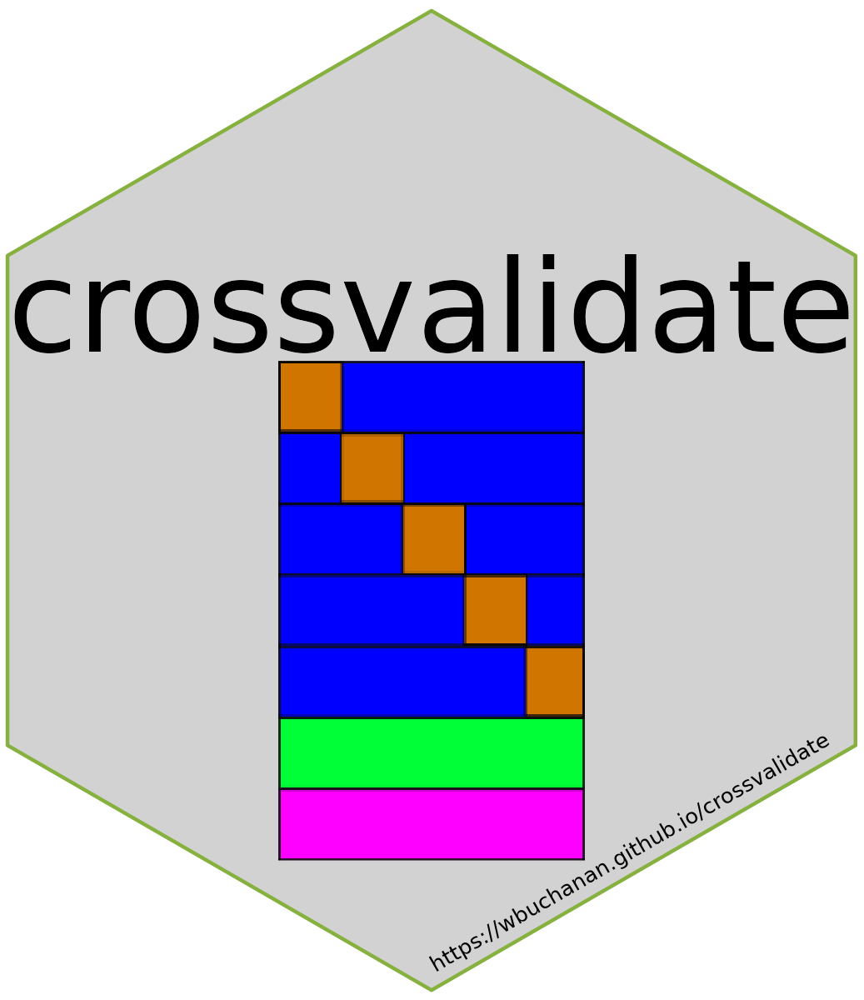

# crossvalidation
The crossvalidate package includes several commands and a Mata library that 
provide a range of possible cross-validation techniques that can be used with 
any Stata estimation command returning results in `e()`.  For the majority of 
users and use cases, the prefix commands (see `xv` and `xvloo`) should handle 
your needs.  If, however, you need to implement something a bit different from 
generic use cases, the package also includes lower level commands that can save 
you time from having to code the entire cross-validation process.  These 
commands are named after the four-steps found in all cross-validation work:
`splitit`, `fitit`, `predictit`, and `validateit`.  There are also a few utility 
commands that take care of the metaprogramming tasks needed to allow these 
commands to be applied to the correct fold/split of the data.

Lastly, we implemented the majority of validation metrics that can be found in 
the R package [yardstick](https://yardstick.tidymodels.org/index.html) in our 
Mata library so you don't have to.  However, if you want to implement your own 
validation metric that is possible and easy to do (see information below which 
specifies the function signature to use for your Mata function that will 
implement your metric) and easy to use with the existing tools (i.e., pass the 
name of your function as an argument to the `metric` or `monitors` options of 
either the prefix commands or `validateit` and it will handle the rest).

## Examples:

```
// Load example dataset
sysuse auto.dta, clear

// Simple train/test (TT) split
xv 0.8, pstub(ttpred) metric(mse): reg price mpg length

// Simple train/validation/test (TVT) split
xv 0.6 0.2, pstub(tvtpred) metric(mse) monitors(mape smape): reg price mpg length

// Leave-One-Out cross valiation with a train/test split
xvloo 0.8, pstub(ttloopred) metric(mse): reg price mpg length

// LOO TVT split
xvloo 0.6 0.2, pstub(tvtloopred) metric(mse): reg price mpg length

// K-Fold TT split
xv 0.8, pstub(ttkfpred) metric(mae) kfold(5): reg price mpg length if !mi(rep78)

// K-Fold TVT split
xv 0.6 0.2, pstub(tvtkfpred) metric(mbe) kfold(3): reg price mpg length, vce(rob)

// Clustered K-Fold TT Split
xv 0.8, metric(phl) uid(rep78) kfold(4) display retain: reg price mpg length, vce(rob)

```

## TODO
- [ ] Standardize language in help files
- [ ] Finish writing test cases for ADO commands

# libxv

## Metrics/Monitors

### Method Signature
The program will allow users to define their own metrics/monitors that are not 
contained in libcrossvalidate.  In order to do this, users must implement a 
specific method/function signature:

```
real scalar metric(string scalar pred, string scalar obs, 
				   string scalar touse, | transmorphic matrix opts)
```				   

The function must return a real valued scalar and take three arguments.  The 
three arguments are used to access the data that would be used to compute the 
metrics/monitors and to provide a method to pass optional arguments to the 
underlying functions if supported.

### Data access
Within the function body, we recommend using the following pattern to access 
the data needed to compute any metrics/monitors:

```
real colvector yhat, y
yhat = st_data(., pred, touse)
y = st_data(., obs, touse)
```

The programs in the cross validate package will handle the construction of the 
variables and passing them to the function name that users pass to the programs. 

### Building the library
Once we are ready to build the Mata library we should do the following using an 
instance of Stata 15.

```
// Clear everything out of Mata
mata: mata clear 

// Define all of the Mata functions in memory
run crossvalidate.mata

// If the library is already built, use this instead:
lmbuild libxv, replace dir(`"`c(pwd)'"')
```

# Prefix Commands
## xv
```
xv # [#], metric(string asis) [seed(integer) uid(varlist) tpoint(string asis)
			 split(string asis) kfold(integer) results(string asis) 
			 fitnm(string asis) classes(integer) pstub(string asis) noall 
			 monitors(string asis) display retain valnm(string asis)
			 pmethod(string asis) popts(string asis)] : 
			 estimation command ...
```

### Syntax and options
* \# - The proportion of the data set to allocate to the training set. _Note if 
the training allocation is set to unity, it will automatically trigger the 
`noall` option.
* [\#] - The proportion of the data set to allocate to the validation set.
* metric(_string asis_) - the name of a function from libxv or a user-defined 
function.  Optional arguments for the metric function can be passed as a matrix.  
For example, metric(ccc((1))) or metric(ccc(("y"))).  See help documentation 
for cases where options are supported, as well as the required format for those 
options.
* kfold(_integer_) - An optional parameter that implements K-Fold 
cross-validation with the number of folds specified by the user.  The default is 
1, which is the equivalent of simple train/test or train/validation/test splits.
* seed(_integer_) - to set the pseudo-random number generator seed
* uid(_varlist_) - a variable list for clustered sampling/splitting.  _Note, the 
variable list must be specified the order from highest to lowest level of 
nesting of the data; cross-classified sampling is not currently supported._
* tpoint(_string asis_) - a numeric, td(), tc(), or tC() value. 
* split(_string asis_) - a new variable name that will store the split 
identifiers in the data.  If a value is passed to the `split`, `pstub`, or 
`results` options it will trigger the `retain` option to be turned on. The 
default value in the case where the `retain` option is on and no value is passed 
to `split` is _xvsplit.
* results(_string asis_) - a stubname for storing estimation results.  The name 
provided cannot end in a number. If a value is passed to the `split`, `pstub`, 
or `results` options it will trigger the `retain` option to be turned on. 
The default value in the case where the `retain` option is on and no value is 
passed to `results` is xvres.
* noall - suppresses fitting the model to the entire training set. _Note: this 
is only applicable to cases where `kfold` > 1 (which includes xvloo)._
* fitnm(_string asis_) - is used to name the collection storing the results; 
the default is xvfit and only applies to users of Stata 17 and above.
* classes(_integer_) - is used to specify the number of classes for 
classification models; default is 0 which is used to denote non-classification 
models.  Additionally, if using a binary outcome, remember that there are two 
(2) classes.
* threshold(_real_) - positive outcome threshold for classification in binary 
outcome models; default is 0.5.
* pstub(_string asis_) - a new variable name for predicted values.   If a value 
is passed to the `split`, `pstub`, or `results` options it will trigger the 
`retain` option to be turned on. The default value in the case where the 
`retain` option is on and no value is passed to `pstub` is _xvpred.  If the 
variable _xvpred already exists a suffix based on the timestamp when the command 
is executed is used.
* monitors(_string asis_) - zero or more function names from libxv or 
user-defined functions.  Optional arguments for the monitors function can be 
passed as a matrix.  For example, monitors(ccc((1)) mae(("y")) rmse((1, 2, 3))).  
See help documentation for cases where options are supported, as well as the 
required format for those options.
* valnm(_string asis_) - is used to name the collection storing the validation 
results; default is xvval and only applies to users of Stata 17 and above.
* pmethod(string asis) - the method (statistic) to predict with the 
out-of-sample/held-out data. Defaults to xb when `classes` == 0 and pr in all 
other cases.
* popts(string asis) - an option that allows users to pass options to 
the predict command in addition to the prediction statistic/method.
* display - display estimation and validation results in the results pane; 
default is off
* retain - retains the `split` and `pstub` variables and stored estimation 
results after execution.  If this option is specified without arguments passed 
to the `split`, `pstub`, or `results` options, the default names are used for 
them.

## xvloo
```
xvloo # [#], metric(string asis) [ seed(integer) uid(varlist) tpoint(string asis)
			 split(string asis) results(string asis) fitnm(string asis) 
			 classes(integer) pstub(string asis) noall monitors(string asis) 
			 display retain valnm(string asis) pmethod(string asis)
			 popts(string asis) ] : 
			 estimation command ...
```

### Syntax and options
* \# - The proportion of the data set to allocate to the training set. _Note if 
the training allocation is set to unity, it will automatically trigger the 
`noall` option.
* [\#] - The proportion of the data set to allocate to the validation set.
* metric(_string asis_) - the name of a function from libxv or a user-defined 
function.  Optional arguments for the metric function can be passed as a matrix.  
For example, metric(ccc((1))) or metric(ccc(("y"))).  See help documentation 
for cases where options are supported, as well as the required format for those 
options.
* seed(_integer_) - to set the pseudo-random number generator seed
* uid(_varlist_) - a variable list for clustered sampling/splitting.  _Note, the 
variable list must be specified the order from highest to lowest level of 
nesting of the data; cross-classified sampling is not currently supported._
* tpoint(_string asis_) - a numeric, td(), tc(), or tC() value. 
* split(_string asis_) - a new variable name that will store the split 
identifiers in the data.  If a value is passed to the `split`, `pstub`, or 
`results` options it will trigger the `retain` option to be turned on. The 
default value in the case where the `retain` option is on and no value is passed 
to `split` is _xvsplit.
* results(_string asis_) - a stubname for storing estimation results.  The name 
provided cannot end in a number. If a value is passed to the `split`, `pstub`, 
or `results` options it will trigger the `retain` option to be turned on. 
The default value in the case where the `retain` option is on and no value is 
passed to `results` is xvres.
* noall - suppresses fitting the model to the entire training set. _Note: this 
is only applicable to cases where `kfold` > 1 (which includes xvloo)._
* fitnm(_string asis_) - is used to name the collection storing the results; 
the default is xvfit and only applies to users of Stata 17 and above.
* classes(_integer_) - is used to specify the number of classes for 
classification models; default is 0 which is used to denote non-classification 
models.  Additionally, if using a binary outcome, remember that there are two 
(2) classes.
* threshold(_real_) - positive outcome threshold for classification in binary 
outcome models; default is 0.5.
* pstub(_string asis_) - a new variable name for predicted values.   If a value 
is passed to the `split`, `pstub`, or `results` options it will trigger the 
`retain` option to be turned on. The default value in the case where the 
`retain` option is on and no value is passed to `pstub` is _xvpred.  If the 
variable _xvpred already exists a suffix based on the timestamp when the command 
is executed is used.
* monitors(_string asis_) - zero or more function names from libxv or 
user-defined functions.  Optional arguments for the monitors function can be 
passed as a matrix.  For example, monitors(ccc((1)) mae(("y")) rmse((1, 2, 3))).  
See help documentation for cases where options are supported, as well as the 
required format for those options.
* valnm(_string asis_) - is used to name the collection storing the validation 
results; default is xvval and only applies to users of Stata 17 and above.
* pmethod(string asis) - the method (statistic) to predict with the 
out-of-sample/held-out data. Defaults to xb when `classes` == 0 and pr in all 
other cases.
* popts(string asis) - an option that allows users to pass options to 
the predict command in addition to the prediction statistic/method.
* display - display estimation and validation results in the results pane; 
default is off
* retain - retains the `split` and `pstub` variables and stored estimation 
results after execution.  If this option is specified without arguments passed 
to the `split`, `pstub`, or `results` options, the default names are used for 
them.

# Phase Specific Commands 

## splitit
```
splitit # [#] [if] [in] [, Uid(varlist) TPoint(string asis) KFold(integer 1) 
						   SPLit(string asis) loo ]
```						   

### Syntax and options
* \# [\#] - At least one numeric value in [0, 1].  A single value is used for 
train/test splits.  Two values are used for train/validate/test splits.  The sum
of the two values must be <= 1.
* <ins>u</ins>id(_varlist_) - A user specified varlist used to identify units 
when splitting the data.  When this is populated all records associated with the 
unit identifier will be added to the train/validate/test split.  If a time point 
is also specified, the time point threshold should retain only cases up to the 
specified time.
* <ins>tp</ins>oint(_string asis_) - A user specified time value that will be used 
to split the data into train/validation/test sets.  Requires the data to be 
-xt/tsset-.  If a panel variable is defined in -xtset- it will be used to ensure the 
split includes entire records prior to the time period used for the split.  If 
-uid- is also specified, it must include the panel variable.
* <ins>kf</ins>old(_integer 1_) - An optional parameter to trigger the use of 
K-Fold crossvalidation.  The number of folds specified will be used to generate 
the splits.  
* <ins>spl</ins>it(_string asis_) - An option to specify the name of the variable 
that will store the identifiers for each of the splits and folds.
* loo - An option used when splitting a dataset for use in leave-one-out 
cross-validation.

## fitit
```
fitit anything(name = cmd), SPLit(passthru) RESults(string asis) 
						  [ Kfold(integer 1) noall DISplay NAme(string asis) ]
```						   

### Syntax and options
* cmd is the estimation command the user wishes to fit to the data
* <ins>spl</ins>it(passthru) - specifies the name of the variable used to 
identify the train/validate/test or KFold splits in the dataset.
* <ins>res</ins>ults(string asis) - A name to use to store estimation results 
`estimates store`.
* <ins>k</ins>fold(integer 1) - An option used to determine if the model needs 
to be fitted over k subsets of the data.
* noall - Is an option to suppress fitting the model to the entire training set 
when the number of folds in the training set is > 1.
* <ins>dis</ins>play - An option to show estimation results from all of the 
models fitted to each of the folds.
* <ins>na</ins>me(_string asis_) - is used to name the collection storing the 
results; the default is xvfit and only applies to users of Stata 17 and above.


## predictit
```
predictit [anything(name = cmd)], PStub(string asis) 
								[ SPLit(passthru) Classes(integer 0) 
								  Kfold(integer 1) THReshold(passthru) 
								  MODifin(string asis) KFIfin(string asis) noall 
								  PMethod(string asis) POpts(string asis) ]
```

### Syntax and options
* cmd is the estimation command the user wishes to fit to the data
* <ins>ps</ins>tub(string asis) - A variable name to use to store the predicted 
values following model fitting.
* <ins>spl</ins>it(passthru) - specifies the name of the variable used to 
identify the train/validate/test or KFold splits in the dataset.
* <ins>c</ins>lasses(integer 0) - An option used to determine whether the model 
is a regression or classification task.  This is subsequently passed to the 
classify program.
* <ins>k</ins>fold(integer 1) - An option used to determine the appropriate 
subset of data to use for predictions.
* <ins>thr</ins>eshold(passthru) - An option that is passed to the classify 
program for predicting class membership in classification tasks.
* <ins>mod</ins>ifin(string asis) - the modified if expression used to generate 
the out of sample predictions.
* <ins>kfi</ins>fin(string asis) - the modified if expression used to generate 
the out of sample predictions for the full training sample when using K-Fold 
cross-validation.
* noall - suppresses prediction on the entire training sample when using K-Fold 
cross-validation.
* <ins>pm</ins>ethod(string asis) - the method (statistic) to predict with the out-of-sample/held-out data. Defaults to xb when `classes` == 0 and pr in all 
other cases.
* <ins>po</ins>pts(string asis) - an option that allows users to pass options to 
the predict command in addition to the prediction statistic/method.

## validateit
```
validateit, MEtric(string asis) PStub(string asis) SPLit(string asis) 
		  [ Obs(string asis) MOnitors(string asis) DISplay KFold(integer 1) 
			noall loo NAme(string asis) ]
```			

### Syntax and options
* <ins>me</ins>tric(string asis) - specifies the name of the Mata function to 
use as the validation metric.  Options can be passed to the metric, see the 
help for libxv or validateit to identify which metrics support this and to 
see the requirements for specifying options.
* <ins>ps</ins>tub(string asis) - A variable name to use to store the predicted 
values following model fitting.
* <ins>spl</ins>it(passthru) - specifies the name of the variable used to 
identify the train/validate/test or KFold splits in the dataset.
* <ins>o</ins>bs(string asis) - the name of the dependent variable from the model.
* <ins>mo</ins>nitors(string asis) - this can be a list of functions used to 
evaluate the model performance on the out of sample data.   Options can be 
passed if the function supports it.  See help documentation for additional info.
* <ins>dis</ins>play - an option to print the monitor and metric values to the 
console.
* <ins>k</ins>fold(integer 1) - An option used to compute validation metrics and 
monitors for each fold, as well as the entire training set if the `noall` option 
is not passed.
* noall - suppresses prediction on the entire training sample when using K-Fold cross-validation.
* loo - Is an option used specifically for leave-one-out cross-validation.  It 
computes validation metrics for the entire training split based on the predicted 
and observed values from each of the folds.  If the `noall` option is omitted it 
will also compute the validation metrics from a model fitted to the entire 
training set with predictions made on the validation set, if present, or test 
set, if no validation set is present.
* <ins>na</ins>me(_string asis_) - is used to name the collection storing the 
results; the default is xvval and only applies to users of Stata 17 and above.

# Utility commands

## classify
```
classify # [if], PStub(string asis) [ THReshold(real 0.5) PMethod(string asis) 
									  POpts(string asis) ]
```									  

### Syntax and options
* \# - This is the number of classes of the outcome variable being modeled.  This 
value must be integer valued.
* <ins>ps</ins>tub(_string asis_) - Specifies a stub name to use to store the 
predicted classes from the model.
* <ins>thr</ins>eshold(_real 0.5_) - Specifies the threshold to use for classification 
of predicted probabilities in the case of binary outcome models.  The value of 
the threshold must be in (0, 1).
* <ins>pm</ins>ethod(string asis) - the method (statistic) to predict with the out-of-sample/held-out data. Defaults to xb when `classes` == 0 and pr in all 
other cases.
* <ins>po</ins>pts(string asis) - an option that allows users to pass options to 
the predict command in addition to the prediction statistic/method.

## state
`state `

### Syntax and options
No options

## cmdmod
```
cmdmod anything(name = cmd id = "estimation command"), 
		SPLit(varlist min = 1 max = 1) [ KFold(integer 1) ]
```		

### Syntax and options
* <ins>spl</ins>it(varlist min = 1 max = 1) - specifies the name of the variable
used to identify the train/validate/test or KFold splits in the dataset that 
will be used to fit the model to the training set and that predictions will use 
the validation set.
* <ins>kf</ins>old(integer 1) - specifies the number of cross-validation folds 
used in the dataset.  The default value indicates that K-Fold cross-validation 
is not being used and the data should be treated like a train/test or 
train/validation/test split.

## libxv
`libxv [, DISplay ]`

### Syntax and options
* <ins>dis</ins>play - displays the libxv help file after recompiling the Mata 
library.
